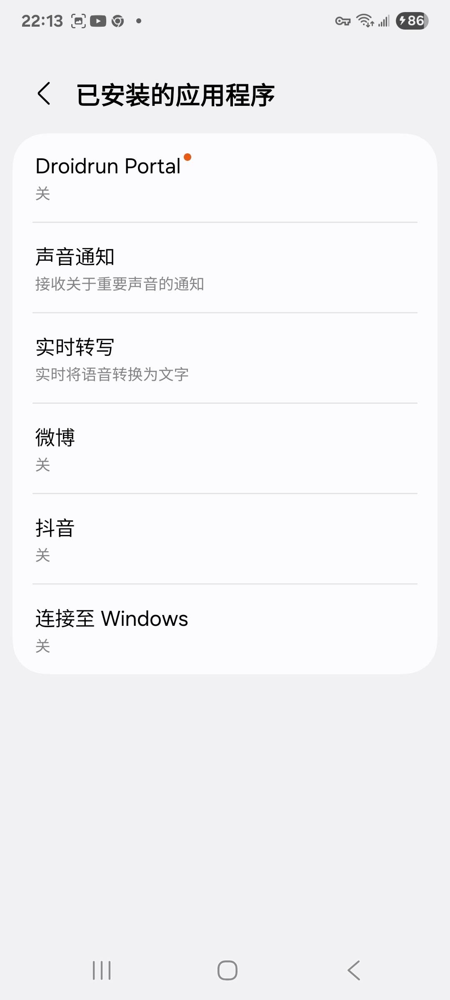
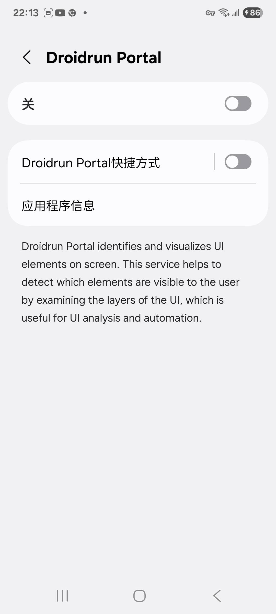
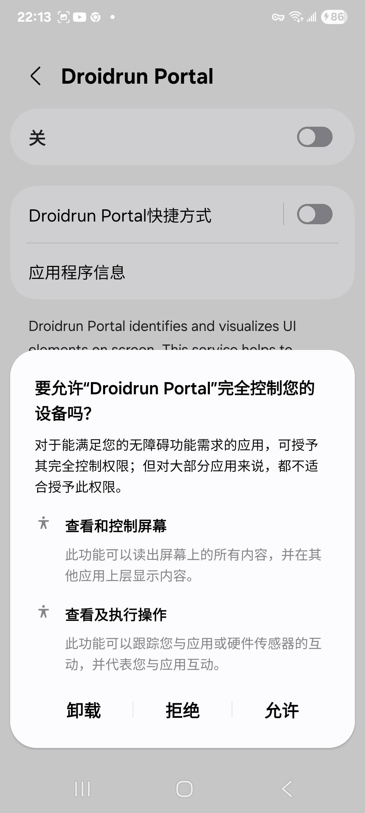
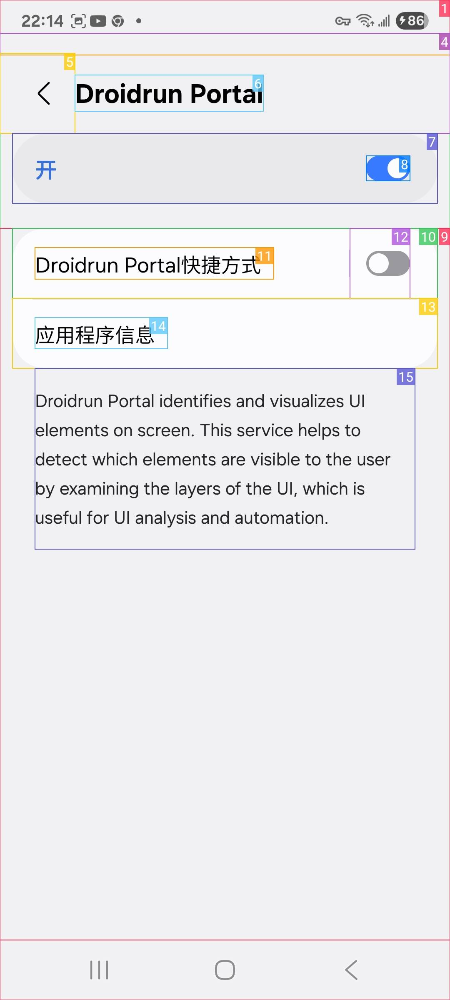
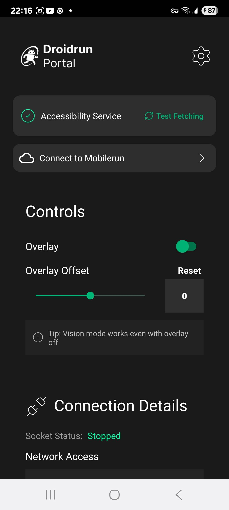

# Droidrun Portal 设置指引

本指引将帮助您完成 Droidrun Portal 应用的设置，以便通过 USB 控制 Android 手机。

## 前提条件

1. Android 手机通过 USB 数据线连接到电脑
2. 手机已开启 USB 调试模式
3. 已下载并安装 Droidrun Portal APK

---

## 设置步骤

### 步骤 1：打开 Droidrun Portal 应用

安装完成后，打开 Droidrun Portal 应用。您将看到主界面显示 **"Accessibility Service Not Enabled"**（辅助功能未启用）的提示。

点击 **"Enable Now"**（立即启用）按钮开始设置。

---

### 步骤 2：进入辅助功能设置

系统将打开手机的**辅助功能**设置页面。在此页面中，找到并点击**"已安装的应用程序"**（Installed Apps）选项。

---

### 步骤 3：找到 Droidrun Portal

在已安装的应用程序列表中，找到并点击 **Droidrun Portal**。

---

### 步骤 4：打开快捷方式开关

在 Droidrun Portal 的设置页面，您会看到：
- 主开关（默认关闭）
- **Droidrun Portal 快捷方式**开关（默认关闭）

首先打开顶部的**主开关**。

---

### 步骤 5：授权完全控制权限

系统会弹出权限请求对话框，询问是否允许 Droidrun Portal **"完全控制您的设备"**。

此权限包含：
- **查看和控制屏幕**：获取屏幕内容并执行点击、滑动等操作
- **查看及执行操作**：识别 UI 元素并与之交互

点击 **"允许"**（Allow）继续。

---

### 步骤 6：确认服务已启用

授权完成后，返回 Droidrun Portal 设置页面，确认开关已显示为**开启状态**。

---

### 步骤 7：返回应用主界面

返回 Droidrun Portal 主界面，此时 **Accessibility Service** 应显示为已启用状态。

您将看到：
- ✅ Accessibility Service：已启用
- Connect to Mobilerun：连接选项
- Controls：控制设置（Overlay、Overlay Offset 等）

---

### 步骤 8：设置 Droidrun 键盘（可选但推荐）

为了获得最佳的文本输入体验，建议设置 Droidrun Keyboard 为默认输入法。

点击 **"Droidrun Keyboard not active"** 提示区域，或进入系统键盘设置：

---

### 步骤 9：选择 Droidrun Keyboard

在输入法选择菜单中，选择 **"Droidrun Keyboard"**。

注意：系统可能会提示此输入法可能收集输入内容，这是正常的，因为自动化工具需要获取输入内容。

---

### 步骤 10：完成设置

设置完成后，返回 Droidrun Portal 主界面。此时所有服务应该都已正确配置：

您将看到：
- ✅ Accessibility Service：已启用
- ✅ Droidrun Keyboard：已激活（如已设置）
- Connection Details：显示 Socket 状态

---

## 故障排除

### 问题：Accessibility Service 无法启用

**解决方案：**
1. 确保已授予所有请求的权限
2. 尝试重启应用
3. 检查手机设置中是否禁用了相关权限

### 问题：无法连接到电脑

**解决方案：**
1. 检查 USB 数据线是否正常
2. 确保手机已开启 USB 调试模式
3. 尝试更换 USB 端口
4. 在电脑上运行 `adb devices` 确认设备已连接

### 问题：文本输入不正常

**解决方案：**
1. 检查 Droidrun Keyboard 是否已设置为默认输入法
2. 如不需要文本输入，可以跳过键盘设置，使用 Accessibility Fallback 模式

---

## 下一步

完成以上设置后，您可以通过电脑使用 cy-mobile-use 技能控制您的 Android 手机了！

查看 [SKILL.md](./SKILL.md) 了解如何使用该技能。
